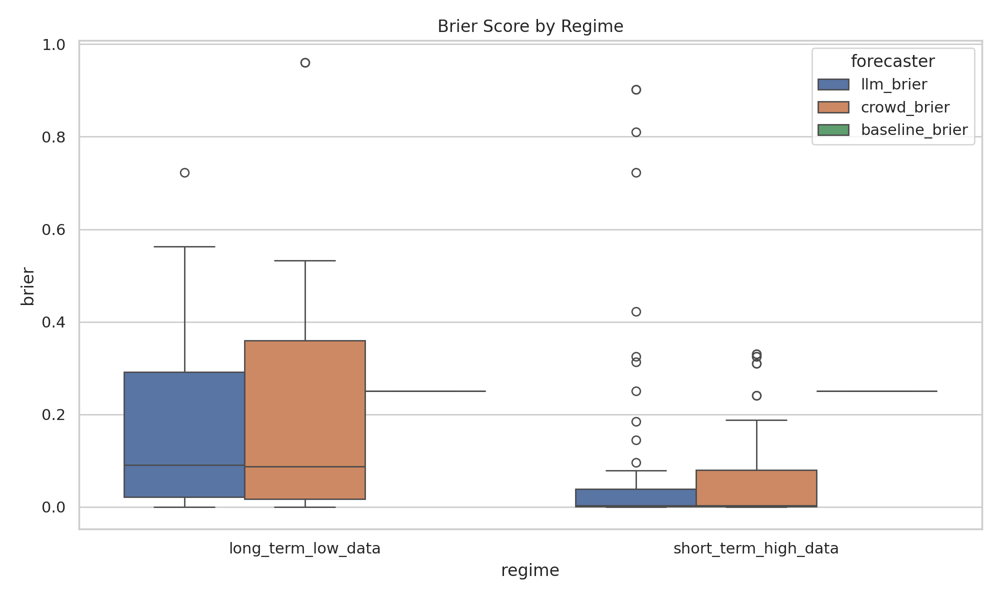
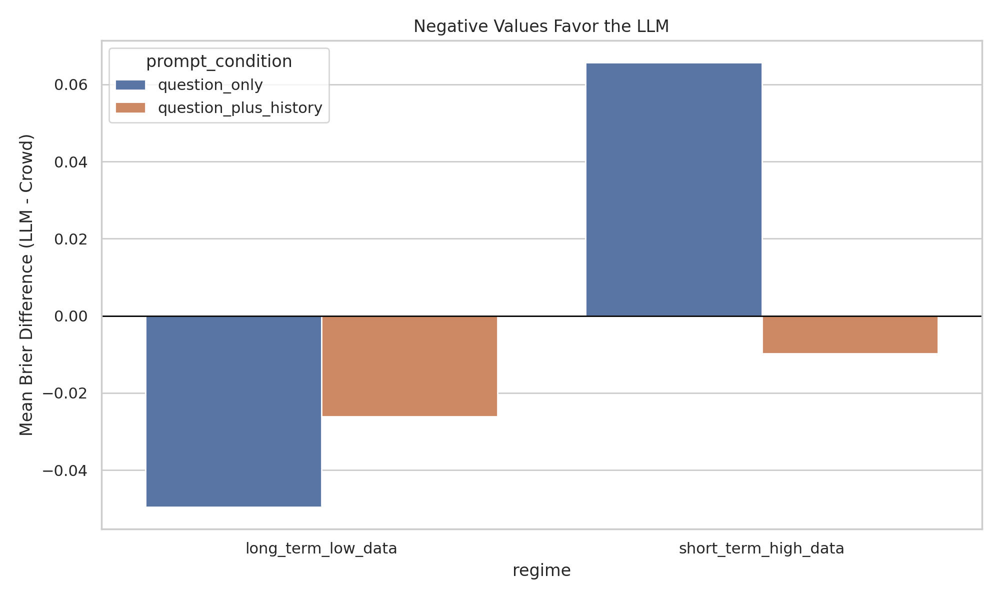
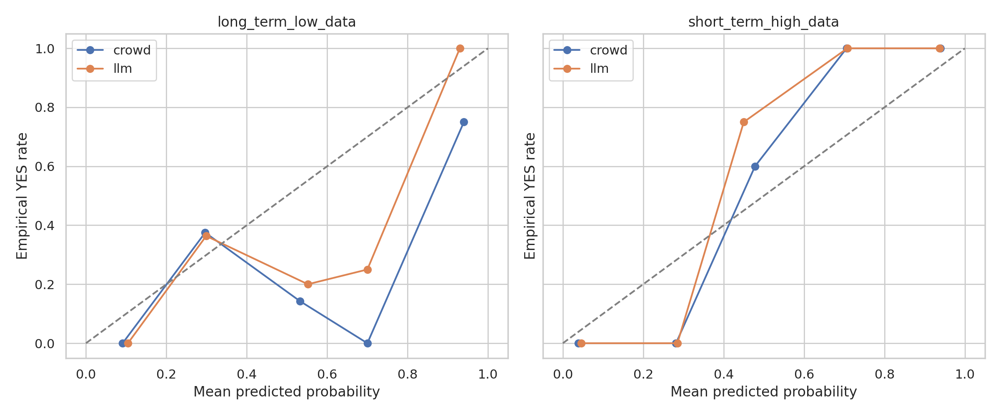

# REPORT: LLMs and Forecasting

## 1. Executive Summary
This project tested whether `gpt-4.1` outperforms human crowd forecasts in two regimes derived from the same binary-question forecasting dataset: `long_term_low_data` and `short_term_high_data`.

The main result is mixed. On long-horizon sparse-information questions, the LLM beat the crowd when prompted only with the question context. On short-horizon dense-information questions, the LLM underperformed the crowd unless it was given the historical crowd trajectory, at which point it nearly matched and slightly beat the crowd on mean Brier. None of the paired LLM-vs-crowd differences reached `p < 0.05` with `n=30` per condition.

Practically, the evidence does not support the blanket claim that LLMs are better than humans in both regimes. It suggests a narrower conclusion: LLMs can be competitive in long-horizon sparse settings from question text alone, while short-horizon performance depends strongly on access to structured historical forecasting data.

## 2. Research Question & Motivation
### Hypothesis
LLMs outperform humans at short-term high-data forecasting and long-term low-data forecasting.

### Why this matters
The question is important for deciding where LLM-based forecasting systems should replace, complement, or aggregate human judgment. Prior work mixes task types: some papers compare LLMs to human crowds on event forecasting, while others study numeric time-series forecasting without human baselines. That makes the user hypothesis hard to test directly.

### Gap addressed here
This study avoids mixing unrelated datasets. It uses one local crowd-forecasting dataset and constructs two matched information regimes from the same questions and trajectories, allowing a more controlled `LLM vs human crowd` comparison.

## 3. Experimental Setup
### Dataset and regime construction
Source dataset: `datasets/forecast_questions_platforms/` test split.

Filtered task:
- resolved binary questions only

Regime definitions:
- `long_term_low_data`: forecast cutoff at least `60` days before resolution and at most `5` crowd predictions observed
- `short_term_high_data`: forecast cutoff at most `14` days before resolution and at least `30` crowd predictions observed

Sampling:
- `30` items per regime
- short-horizon sample chosen to avoid question overlap with the long-horizon sample
- total evaluated forecasts: `120` (`60` items x `2` prompt conditions)

Observed regime characteristics from the final sample:

| Regime | Avg days to resolution | Median days | Avg crowd predictions seen | Median predictions |
|---|---:|---:|---:|---:|
| `long_term_low_data` | 119.2 | 125.0 | 1.0 | 1.0 |
| `short_term_high_data` | 1.5 | 1.0 | 100.0 | 101.0 |

### Model and prompting
Model:
- `gpt-4.1`

API settings:
- temperature `0.0`
- JSON-only response format

Prompt conditions:
- `question_only`: question, dates, background, resolution criteria
- `question_plus_history`: same as above plus a structured summary of crowd trajectory available before the cutoff

Prompt template:
- [prompts/forecast_prompt.txt](/workspaces/llm-forecasting-3be2-codex/prompts/forecast_prompt.txt)

### Baselines
- human crowd probability at the same cutoff
- `0.5` no-information baseline

### Metrics
- primary: Brier score
- secondary: log loss, accuracy, bucketed calibration

### Statistical analysis
- Wilcoxon signed-rank test on paired Brier scores
- bootstrap `95%` CI for mean paired difference (`LLM - crowd`)

### Compute and environment
- Python `3.12.8`
- `openai 2.38.0`, `numpy 2.4.6`, `pandas 3.0.3`
- GPU detected: `4 x NVIDIA RTX A6000 (49 GB each)`
- GPU not used because the experiment was API-based

Token usage:
- `question_only`: `42,145` total tokens
- `question_plus_history`: `53,003` total tokens
- total: `95,148` tokens

Approximate API cost using the pricing assumption in the task prompt (`$1.25/M` input, `$10/M` output):
- about `$0.22`

Outputs:
- raw model outputs: [results/model_outputs](/workspaces/llm-forecasting-3be2-codex/results/model_outputs)
- analysis tables: [results/analysis](/workspaces/llm-forecasting-3be2-codex/results/analysis)
- figures: [figures](/workspaces/llm-forecasting-3be2-codex/figures)

## 4. Results
### Main metric table

| Regime | Prompt | n | LLM Brier | Crowd Brier | 0.5 Baseline | LLM Acc. | Crowd Acc. | Mean Brier Diff (`LLM - Crowd`) |
|---|---|---:|---:|---:|---:|---:|---:|---:|
| `long_term_low_data` | `question_only` | 30 | 0.151 | 0.200 | 0.250 | 0.767 | 0.600 | -0.050 |
| `long_term_low_data` | `question_plus_history` | 30 | 0.174 | 0.200 | 0.250 | 0.633 | 0.600 | -0.026 |
| `short_term_high_data` | `question_only` | 30 | 0.131 | 0.065 | 0.250 | 0.833 | 0.900 | +0.066 |
| `short_term_high_data` | `question_plus_history` | 30 | 0.056 | 0.065 | 0.250 | 0.933 | 0.900 | -0.010 |

### Paired tests

| Regime | Prompt | Wilcoxon p-value | Mean Brier Diff (`LLM - Crowd`) | 95% CI |
|---|---|---:|---:|---|
| `long_term_low_data` | `question_only` | 0.309 | -0.050 | [-0.143, 0.037] |
| `long_term_low_data` | `question_plus_history` | 0.889 | -0.026 | [-0.078, 0.018] |
| `short_term_high_data` | `question_only` | 0.943 | +0.066 | [-0.012, 0.154] |
| `short_term_high_data` | `question_plus_history` | 0.239 | -0.010 | [-0.031, 0.001] |

### Key figures

## 5. Analysis & Discussion
### What supports the hypothesis
The strongest support appears in `long_term_low_data` with `question_only`. Here the LLM beat the crowd by about `0.050` Brier and by `0.167` absolute accuracy. This matches the intuition that long-horizon sparse questions benefit from broader textual reasoning rather than crowd momentum.

### What contradicts the hypothesis
The `short_term_high_data` result depends on prompt condition. Without crowd-history input, the LLM was much worse than the crowd (`0.131` vs `0.065` Brier). The worst misses were mostly late-breaking YES events where the model stayed near `0.05-0.15` while the crowd had already moved upward.

### What changed when history was added
Adding structured trajectory history helped the short-horizon regime substantially:
- short-term Brier improved from `0.131` to `0.056`
- long-term Brier worsened from `0.151` to `0.174`

This suggests two different mechanisms:
- in sparse long-horizon settings, crowd history may add little and may even anchor the LLM too much
- in dense short-horizon settings, recent trajectory information is critical and the LLM can use it to nearly match the crowd

### Error analysis
Representative long-horizon crowd failures:
- The crowd assigned `0.98` to the labor-force-participation question that resolved NO; the LLM gave `0.45` and incurred far less loss.
- On Serbia/Kosovo conflict, the crowd was at `0.70` and the LLM at `0.18`; the event resolved NO, favoring the LLM.

Representative short-horizon LLM failures without history:
- The model assigned `0.05` to several eventual YES questions that the crowd had already moved toward, including a Biden impeachment inquiry and Spain winning the 2023 Women's World Cup.
- These errors largely disappeared when trajectory history was supplied, indicating that the model was not independently tracking late-stage consensus shifts from question text alone.

### Relation to literature
The results align with the literature review rather than the strong form of the user hypothesis:
- they fit the claim that LLMs can be competitive in low-data judgmental forecasting
- they do not support a broad claim of LLM dominance over humans in short-term high-data forecasting
- they show that any short-term advantage is conditional on providing structured historical forecast information

## 6. Limitations
- Sample size is modest: `30` items per regime and prompt condition.
- No live retrieval was used, so the LLM saw only local dataset context rather than open-web evidence available to a real forecaster.
- The `question_plus_history` condition is not a pure independent forecast because it exposes human trajectory information to the LLM.
- The long-horizon regime is especially sparse, with a mean of only `1` observed prediction at the cutoff; this is a strong but narrow operationalization of "low-data."
- The short-horizon sample is dominated by Metaculus questions, which may limit generalization across platforms.
- None of the LLM-vs-crowd comparisons were statistically significant at `alpha=0.05`, so the direction of effects should be treated as suggestive, not definitive.

## 7. Conclusions & Next Steps
This experiment does not fully confirm the hypothesis that LLMs are better than humans at both short-term high-data forecasting and long-term low-data forecasting. A more accurate conclusion is that `gpt-4.1` was competitive and directionally better in long-term low-data settings from question context alone, but in short-term high-data settings it needed access to historical crowd trajectories to match or slightly beat the crowd.

The next experiments should be:
1. Add live retrieval at the historical cutoff date to test whether external evidence closes the short-horizon gap without relying on crowd trajectories.
2. Increase sample size and stratify by domain and platform.
3. Compare `gpt-4.1` with `gpt-5` and at least one non-OpenAI model.
4. Add a stricter ablation that provides numeric news/event indicators but not crowd probabilities.

## References
- Halawi, D., Zhang, F., Chen, Y.-H., and Steinhardt, J. (2024). *Approaching Human-Level Forecasting with Language Models*.
- Schoenegger, P., and Park, P. S. (2023). *Large Language Model Prediction Capabilities: Evidence from a Real-World Forecasting Tournament*.
- Paleka, D. et al. (2024). *Consistency Checks for Language Model Forecasters*.
- Full literature synthesis: [literature_review.md](/workspaces/llm-forecasting-3be2-codex/literature_review.md)
